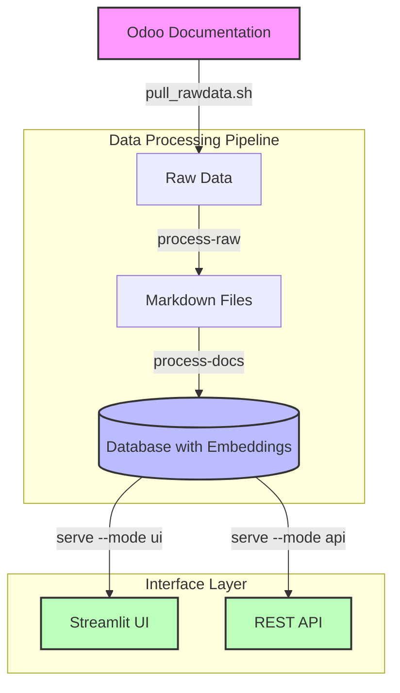

# Odoo Expert
RAG-Powered Odoo Documentation Assistant

Demo Video: https://fanyangmeng.blog/introducing-odoo-expert/

> ⚠️ PLEASE NOTE: This project is in ALPHA stage
> This is an early release that is still under heavy development. Breaking changes can and will happen at any time without prior notice. The API, database schema, and core functionality may change significantly between versions. While we welcome testing and feedback, this version is not recommended for production use.
> This project is not sponsored or endrosed by Odoo S.A. or Odoo Inc. yet. I am developing this project as a personal project with the intention of helping the Odoo community on my own.

A comprehensive documentation processing and chat system that converts Odoo's documentation to a searchable knowledge base with an AI-powered chat interface. This tool supports multiple Odoo versions (16.0, 17.0, 18.0) and provides semantic search capabilities powered by OpenAI embeddings.

## Initial Intention Behind This Project

The project was conceived with the vision of enhancing the Odoo documentation experience. The goal was to create a system similar to Perplexity or Google, where users could receive AI-powered answers directly within the documentation website, complete with proper source links. This eliminates the need for users to manually navigate through complex documentation structures.

## How it works?



The system operates through a pipeline of data processing and serving steps:

1. **Documentation Pulling**: Fetches raw documentation from Odoo's repositories
2. **Format Conversion**: Converts RST files to Markdown for better AI processing
3. **Embedding Generation**: Processes Markdown files and stores them with embeddings
4. **Interface Layer**: Provides both UI and API access to the processed knowledge base

## Features

### Core Functionality

- Documentation Processing: Automated conversion of RST to Markdown with smart preprocessing
- Semantic Search: Real-time semantic search across documentation versions
- AI-Powered Chat: Context-aware responses with source citations
- Multi-Version Support: Comprehensive support for Odoo versions 16.0, 17.0, and 18.0
- Always updated: Efficiently detect and process documentation updates.

### Interface Options

- Web UI: Streamlit-based interface for interactive querying
- REST API: Authenticated endpoints for programmatic access
- CLI: Command-line interface for document processing and chat

## Prerequisites

- Docker and Docker Compose
- Supabase: Both selfhosted version and hosted version are supported
- OpenAI API access
- Git

if you want to do source install, you need to install the following dependencies:

- Python 3.10+
- Pandoc

## Installation & Usage

Assuming Supabase table name is `odoo_docs`. If you have a different table name, please update the table name in the following SQL commands.

### Docker Compose Install

1. Download the [docker-compose.yml](./docker-compose.yml) file to your local machine.
2. Set up environment variables in the `.env` file by using the `.env.example` file as a template.
   ```bash
    OPENAI_API_KEY=your_openai_api_key
    OPENAI_API_BASE=https://api.openai.com/v1
    SUPABASE_SERVICE_KEY=your_supabase_service_key
    SUPABASE_URL=your_supabase_url
    SUPABASE_TABLE=your_supabase_table_name
    LLM_MODEL=gpt-4o
    BEARER_TOKEN=comma_separated_bearer_tokens
    CORS_ORIGINS=comma_separated_cors_origins
   ```
3. Run the following command:
    ```bash
    docker-compose up -d
    ```
4. Set up database: Run `src/sqls/create_table_schema.sql` to create the table and `src/sqls/search_odoo_docs.sql` to create the search function by using Supabase's SQL editor.
5. Pull the raw data and write to your supabase table:
    ```bash
    # Pull documentation
    docker compose run --rm odoo-expert ./pull_rawdata.sh

    # Convert RST to Markdown
    docker compose run --rm odoo-expert python main.py process-raw --raw-dir ./raw_data --output-dir ./markdown

    # Process documents
    docker compose run --rm odoo-expert python main.py process-docs ./markdown
    ```
6. Database indexing: Run the following command to create the search index by using Supabase's SQL editor.
    ```sql
    SET maintenance_work_mem = '128MB';
    CREATE INDEX idx_odoo_docs_version ON odoo_docs (version);

    CREATE INDEX idx_odoo_docs_embedding ON odoo_docs
    USING ivfflat (embedding vector_cosine_ops)
    WITH (lists = 328);
    ```
7. Access the UI at port 8501 and the API at port 8000
8. Docker compose will automatically pull the latest changes and update the system once a day, or you can manually update by running the following command:
    ```bash
    docker compose run --rm odoo-expert python main.py check-updates
    ```

### Source Install

1. Pull Odoo documentation:
    ```bash
    chmod +x pull_rawdata.sh
    ./pull_rawdata.sh
    ```
2. Convert RST to Markdown:
    ```bash
    python main.py process-raw --raw-dir ./raw_data --output-dir ./markdown
    ```
3. Set up database: Run `src/sqls/create_table_schema.sql` to create the table and `src/sqls/search_odoo_docs.sql` to create the search function by using Supabase's SQL editor.
4. Process and embed documents:
    ```bash
    python main.py process-docs ./markdown
    ```
5. Launch the chat interface:
    ```bash
    python main.py serve --mode ui
    ```
6. Launch the API:
    ```bash
    python main.py serve --mode api
    ```
7. Database indexing: Run the following command to create the search index by using Supabase's SQL editor.
    ```sql
    SET maintenance_work_mem = '128MB';
    CREATE INDEX idx_odoo_docs_version ON odoo_docs (version);

    CREATE INDEX idx_odoo_docs_embedding ON odoo_docs
    USING ivfflat (embedding vector_cosine_ops)
    WITH (lists = 328);
    ```
8. Access the UI at port 8501 and the API at port 8000
9. To sync with the latest changes in the Odoo documentation, run the following command:
    ```bash
    python main.py check-updates
    ```

This command will:
1. Scan RST files for changes across all supported Odoo versions
2. Convert modified RST files to markdown
3. Update the embeddings database for changed content
4. Maintain a local cache to track file changes

## API Endpoints

The project provides a REST API for programmatic access to the documentation assistant.

### Authentication

All API endpoints require Bearer token authentication. Add your API token in the Authorization header:
```bash
Authorization: Bearer your-api-token
```

### Endpoints

POST `/api/chat`
Query the documentation and get AI-powered responses.

Request body:
```json
{
    "query": "string",        // The question about Odoo
    "version": integer,       // Odoo version (160, 170, or 180)
    "conversation_history": [ // Optional
        {
            "user": "string",
            "assistant": "string"
        }
    ]
}
```

Response:
```json
{
    "answer": "string",       // AI-generated response
    "sources": [              // Reference documents used
        {
            "url": "string",
            "title": "string"
        }
    ]
}
```

Example:
```bash
curl -X POST "http://localhost:8000/api/chat" \
-H "Authorization: Bearer your-api-token" \
-H "Content-Type: application/json" \
-d '{
    "query": "How do I install Odoo?",
    "version": 180,
    "conversation_history": []
}'
```

POST `/api/stream`
Query the documentation and get AI-powered responses in streaming format.

Request body:
```json
{
    "query": "string",        // The question about Odoo
    "version": integer,       // Odoo version (160, 170, or 180)
    "conversation_history": [ // Optional
        {
            "user": "string",
            "assistant": "string"
        }
    ]
}
```

Response:
Stream of text chunks (text/event-stream content type)

Example:
```bash
curl -X POST "http://localhost:8000/api/stream" \
-H "Authorization: Bearer your-api-token" \
-H "Content-Type: application/json" \
-d '{
    "query": "How do I install Odoo?",
    "version": 180,
    "conversation_history": []
}'
```

## Future Roadmap

1. Allow set versions in the env and run the pipe with those versions automatically.
2. Add more API endpoints for more advanced features, like streaming chat.

## What Are the Potential Applications?

While initially focused on Odoo documentation, the system's architecture makes it highly adaptable for various documentation management scenarios:

- Internal knowledge base systems
- Technical documentation portals
- Customer support systems
- Educational content management
- API documentation assistance

The underlying RAG (Retrieval-Augmented Generation) architecture can be extended to process and serve any structured documentation, making it valuable for organizations looking to enhance their documentation accessibility and searchability.


## Support
If you encounter any issues or have questions, please:

Check the known issues
Create a new issue in the GitHub repository
Provide detailed information about your environment and the problem

## Contributing
Contributions are welcome! Please feel free to submit a Pull Request.

Thanks for the following contributors during the development of this project:

- [Viet Din (Desdaemon)](https://github.com/Desdaemon): Giving me important suggestions on how to improve the performance.

## License

This project is licensed under [Apache License 2.0](./LICENSE): No warranty is provided. You can use this project for any purpose, but you must include the original copyright and license.

Extra license [CC-BY-SA 4.0](./LICENSE-DOCS) to align with the original Odoo/Documentation license.
